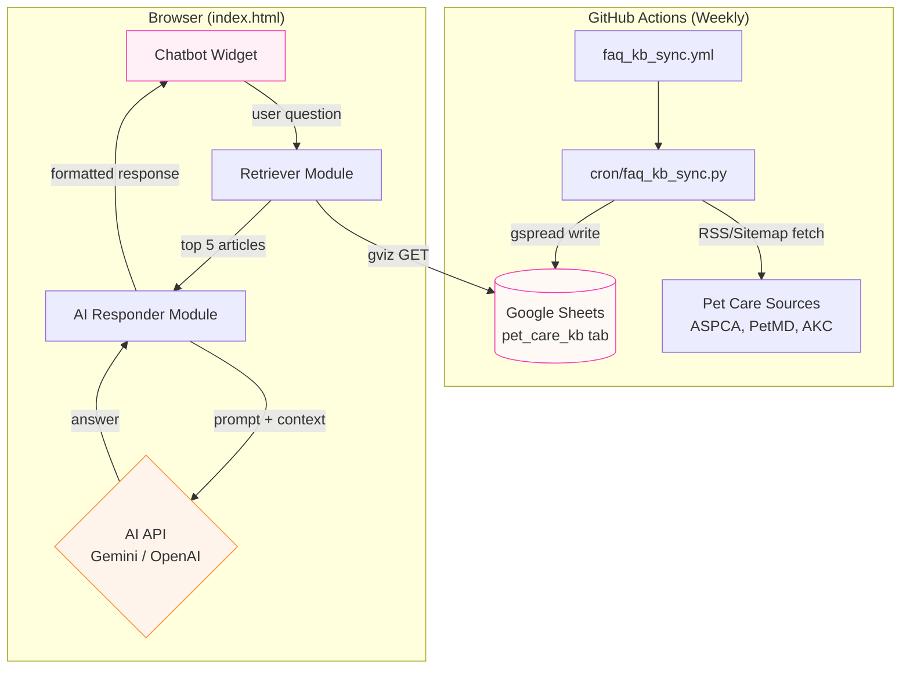
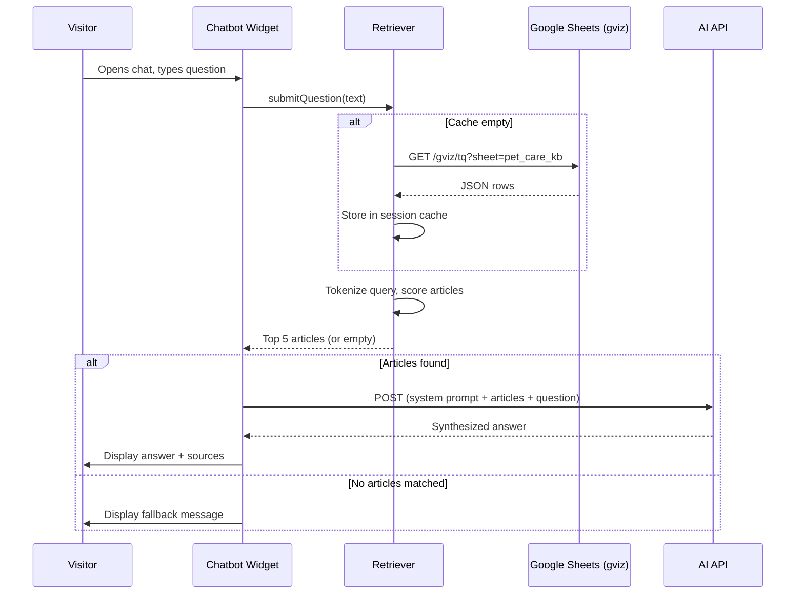

# Design Document: Pet Care FAQ Chatbot

## Overview

This design describes a floating AI-powered FAQ chatbot widget for The Furever Home pet adoption website. The chatbot answers pet care questions by retrieving relevant articles from a curated knowledge base (stored in Google Sheets) and synthesizing concise answers via a generative AI API. The system has three main subsystems:

1. **KB Sync Script** — A Python cron job that fetches pet care articles from reputable sources and writes them to a dedicated Google Sheets tab (`pet_care_kb`).
2. **Client-Side Retriever** — JavaScript that fetches the knowledge base via the gviz endpoint, scores articles against the user's query using keyword matching, and returns top results.
3. **Chatbot Widget + AI Responder** — A floating UI panel embedded in `index.html` that displays conversation, sends context + question to an AI API (Gemini or OpenAI fallback), and renders synthesized answers with source citations.

All frontend code lives in the single `index.html` file with no build tools. The sync script mirrors the existing `petfinder_sync.py` pattern.

---

## Architecture



### Data Flow



---

## Components and Interfaces

### 1. Chatbot Widget (HTML/CSS/JS in `index.html`)

**Responsibility**: Render floating button, chat panel, conversation history, input handling, and display AI responses.

| Element | Description |
|---------|-------------|
| `.chatbot-fab` | Floating action button (56px circle), fixed bottom-right, z-index: 400 |
| `.chatbot-panel` | Chat panel (320×480 desktop, full-width mobile), contains header, messages area, input bar |
| `.chatbot-messages` | Scrollable conversation area with auto-scroll |
| `.chatbot-input` | Textarea with 500-char limit, Enter to send, Shift+Enter for newline |
| `.chatbot-send` | Send button with aria-label |

**Interface**:
```javascript
// Widget state
const ChatbotWidget = {
  isOpen: false,
  messages: [],       // { role: 'user'|'assistant', text: string, sources?: Article[] }
  isLoading: false,

  open(),             // Show panel, focus input, show welcome on first open
  close(),            // Hide panel, preserve messages
  submit(text),       // Validate → add user msg → call Retriever → call AI → add response
  addMessage(msg),    // Append to messages[], render, auto-scroll
  showTyping(),       // Show animated ellipsis
  hideTyping(),       // Remove typing indicator
  setInputEnabled(b), // Enable/disable input + send button
};
```

### 2. Retriever Module (JS in `index.html`)

**Responsibility**: Fetch knowledge base, cache it, score articles by keyword relevance.

**Interface**:
```javascript
const Retriever = {
  cache: null,         // Cached KB rows (session lifetime)
  STOP_WORDS: Set,     // Common English stop words to exclude

  async fetchKB(),     // GET gviz endpoint, parse, cache; throws on HTTP error or timeout
  tokenize(text),      // Lowercase, split on non-alpha, filter stop words → string[]
  score(article, queryTokens),  // Count matching tokens in keywords + title + summary
  async search(query), // fetchKB if needed → score all → sort desc → top 5
};
```

**Scoring algorithm**:
- Tokenize query into lowercase terms, remove stop words
- For each article: count occurrences of query tokens in `keywords` (comma-split), `title` (tokenized), and `summary` (tokenized)
- Each field match counts 1 point (a token matching in keywords AND title = 2 points)
- Sort descending by score, break ties alphabetically by title (ascending)
- Return top 5 (or fewer if KB has fewer articles)

### 3. AI Responder Module (JS in `index.html`)

**Responsibility**: Construct prompt, call AI API, parse response, handle errors and fallback.

**Interface**:
```javascript
const AIResponder = {
  async generateAnswer(question, articles),  // → { answer: string, isRefusal: boolean }
  buildPrompt(question, articles),           // → { systemPrompt, userContent }
  async callGemini(prompt),                  // Primary API call
  async callOpenAI(prompt),                  // Fallback API call
};
```

**System prompt** (sent to AI):
```
You are a helpful pet care assistant for The Furever Home adoption website.
Answer ONLY pet care related questions using ONLY the provided context articles.
Respond in 3 sentences or fewer.
If the question is not about pet care, respond with: "I can only help with pet care questions. Try asking about nutrition, training, health, or behavior for your pet!"
Do not make up information not found in the provided articles.
```

### 4. KB Sync Script (`cron/faq_kb_sync.py`)

**Responsibility**: Fetch articles from pet care sources, extract/transform data, write to Google Sheets.

**Interface** (CLI):
```
python cron/faq_kb_sync.py [--dry-run]
```

**Architecture mirrors `petfinder_sync.py`**:
1. Load credentials from env vars (`GOOGLE_CREDENTIALS_JSON`, `SHEET_ID`)
2. Fetch articles from RSS feeds (ASPCA, PetMD, AKC)
3. For each article: extract title, URL, source, category, summary, keywords, fullText
4. Deduplicate by `articleId` (hash of canonical URL)
5. Write new articles to `pet_care_kb` sheet via gspread
6. Trim to 500 rows if exceeded (oldest `fetchedAt` removed first)
7. Print summary

### 5. GitHub Actions Workflow (`.github/workflows/faq_kb_sync.yml`)

**Responsibility**: Run KB sync script weekly on schedule.

**Mirrors existing `nightly_sync.yml` pattern**: checkout → setup Python 3.11 → install deps → run script with credentials injected via secrets.

---

## Data Models

### Knowledge Base Article (Google Sheets row in `pet_care_kb` tab)

| Column | Type | Constraints | Description |
|--------|------|-------------|-------------|
| `articleId` | string | Unique, non-empty | SHA-256 hash (first 12 hex chars) of canonical URL |
| `title` | string | Non-empty | Article headline |
| `url` | string | Valid URL | Canonical article URL |
| `source` | string | Non-empty | Source name (e.g., "ASPCA", "PetMD", "AKC") |
| `category` | string | One of: "nutrition", "training", "health", "behavior", "general" | Topic category |
| `summary` | string | ≤ 300 chars | Brief description of article content |
| `keywords` | string | Comma-separated, ≤ 20 terms, all lowercase | Search terms extracted from title + summary |
| `fullText` | string | ≤ 1,500 chars, plain text, ends at word boundary | Article body excerpt (HTML stripped) |
| `fetchedAt` | string | ISO 8601 UTC (e.g., `2024-06-15T02:00:00Z`) | Timestamp when row was written |

### Chatbot Message (in-memory JS object)

```javascript
{
  role: 'user' | 'assistant' | 'system',
  text: string,
  sources: [                    // Only present for assistant messages with articles
    { title: string, url: string }
  ] | undefined,
  timestamp: number             // Date.now()
}
```

### Chatbot Configuration (window global)

```javascript
window.CHATBOT_CONFIG = {
  apiKey: '',           // Google Gemini API key (primary)
  openaiApiKey: '',     // OpenAI API key (fallback)
  sheetId: '1Xg4T3vmhoLxN0C2lEBFaN88Y2LSvoF6DQVoCxL3dt80',
  kbSheetName: 'pet_care_kb',
};
```

### Retriever Cache Structure (in-memory)

```javascript
{
  articles: [           // Array of parsed KB rows
    {
      articleId: string,
      title: string,
      url: string,
      source: string,
      category: string,
      summary: string,
      keywords: string[],   // Pre-split from comma-separated string
      fullText: string,
      fetchedAt: string
    }
  ],
  fetchedAt: number     // Date.now() when cache was populated
}
```

---


## Correctness Properties

*A property is a characteristic or behavior that should hold true across all valid executions of a system — essentially, a formal statement about what the system should do. Properties serve as the bridge between human-readable specifications and machine-verifiable correctness guarantees.*

### Property 1: Article ID uniqueness (deduplication)

*For any* set of articles written to the Knowledge Base by the KB Sync Script, no two rows shall share the same `articleId` value. When an article with an existing `articleId` is encountered, it shall be skipped and the existing row shall remain unchanged.

**Validates: Requirements 2.3**

### Property 2: Keyword extraction constraints

*For any* article title and summary input, the keyword extraction function shall produce a comma-separated list of at most 10 terms, where every term is lowercase and contains only alphabetic characters.

**Validates: Requirements 2.4, 3.3**

### Property 3: Text truncation at word boundary

*For any* input text string, the truncation function shall produce output that is at most 1,500 characters long, contains no HTML markup tags, and ends at a complete word boundary (no partial words at the end).

**Validates: Requirements 2.5, 3.3**

### Property 4: Knowledge Base row cap enforcement

*For any* Knowledge Base state with N rows where N > 500, after the pruning operation completes, the row count shall be ≤ 500 and the removed rows shall be exactly those with the lowest (oldest) `fetchedAt` values.

**Validates: Requirements 2.7**

### Property 5: Retriever scoring correctness

*For any* user query and any Knowledge Base article, the Retriever's score for that article shall equal the total count of distinct query tokens (after stop-word removal and lowercasing) that appear in the article's `keywords` list, tokenized `title`, or tokenized `summary` fields, counting each field match independently.

**Validates: Requirements 4.2**

### Property 6: Retriever ranking invariant

*For any* set of scored articles returned by the Retriever, the result shall contain at most 5 articles, sorted in descending order by score, with ties broken by ascending alphabetical order of `title`.

**Validates: Requirements 4.3**

### Property 7: Whitespace-only input rejection

*For any* string composed entirely of whitespace characters (spaces, tabs, newlines, or empty string), the input validation function shall reject submission and the message list shall remain unchanged.

**Validates: Requirements 7.3**

### Property 8: Character limit enforcement

*For any* input string with length greater than 500, the text input field shall not accept characters beyond position 500. *For any* input string with length ≥ 450, the character counter shall be visible and display exactly `500 - length` as the remaining count.

**Validates: Requirements 7.6**

### Property 9: AI API fallback selection

*For any* configuration state of `window.CHATBOT_CONFIG`, when `apiKey` is a non-empty string the AI Responder shall call the Gemini API; when `apiKey` is absent, null, undefined, or an empty string, the AI Responder shall call the OpenAI API using `openaiApiKey`.

**Validates: Requirements 5.6**

### Property 10: Prompt context completeness

*For any* non-empty set of retrieved articles (up to 5), the AI Responder's constructed prompt shall include the `summary` and `fullText` fields of every article in the set, along with the original user question.

**Validates: Requirements 5.1**

---

## Error Handling

| Scenario | Component | Behavior |
|----------|-----------|----------|
| gviz endpoint returns HTTP ≥ 400 | Retriever | Surface error message to widget: "I'm having trouble loading my knowledge base. Please try again shortly." No retry. |
| gviz fetch exceeds 5 seconds | Retriever | Abort via `AbortController` + `setTimeout`. Surface timeout message. |
| AI API returns HTTP error or network failure | AI Responder | Display: "I'm having trouble connecting right now — please try again shortly." Never expose API keys or raw error details. |
| AI API response timeout (30s) | AI Responder | Abort request, re-enable input, show timeout message. |
| No articles match query (all scores = 0) | Retriever → Widget | Return empty result. Widget displays: "I couldn't find relevant articles for that question. Try rephrasing or ask about a different pet care topic." |
| KB has 0 rows | Retriever | Return empty result set (same as no-match). |
| RSS/HTTP fetch fails in sync script | KB Sync Script | Log error with source name + URL, skip article, continue with remaining sources. |
| Gemini key missing and OpenAI key also missing | AI Responder | Display: "Chat is not configured yet. Please check back later." |
| User submits empty/whitespace input | Widget | Silently reject, keep focus on input field. No error message needed. |
| KB Sync Script encounters > 500 rows | KB Sync Script | Delete oldest rows (by `fetchedAt`) until ≤ 500 remain. |

---

## Testing Strategy

### Unit Tests (Example-Based)

Focus on specific scenarios, edge cases, and integration points:

- **Widget UI**: Panel open/close preserves messages, welcome message on first open, typing indicator visibility, auto-scroll behavior, responsive dimensions at 768px breakpoint
- **Input handling**: Enter submits, Shift+Enter inserts newline, input disabled during loading, re-enabled after response/error/timeout, focus management on panel open
- **Accessibility**: Verify aria-labels, focus management, keyboard navigation
- **Error display**: Correct messages for API failures, timeouts, no-match scenarios; no key exposure
- **AI Responder**: Refusal detection hides sources section, correct system prompt content
- **KB Sync Script**: Dry-run mode outputs without writing, summary format, error logging on HTTP failures

### Property-Based Tests

Each property test uses a PBT library (fast-check for JavaScript, Hypothesis for Python) with minimum 100 iterations per property.

| Property | Target | Library | Notes |
|----------|--------|---------|-------|
| 1: Article ID uniqueness | `cron/faq_kb_sync.py` dedup logic | Hypothesis | Generate random article lists with duplicate URLs |
| 2: Keyword extraction constraints | `cron/faq_kb_sync.py` keyword extractor | Hypothesis | Generate random title+summary strings |
| 3: Text truncation | `cron/faq_kb_sync.py` truncation function | Hypothesis | Generate random strings of varying length |
| 4: KB row cap | `cron/faq_kb_sync.py` prune logic | Hypothesis | Generate random row counts and timestamps |
| 5: Scoring correctness | Retriever.score() in JS | fast-check | Generate random query tokens and article fields |
| 6: Ranking invariant | Retriever.search() in JS | fast-check | Generate random scored article arrays |
| 7: Whitespace rejection | Widget.submit() validation in JS | fast-check | Generate random whitespace strings |
| 8: Character limit | Widget input handler in JS | fast-check | Generate random strings of varying lengths |
| 9: API fallback selection | AIResponder API selection in JS | fast-check | Generate random config objects |
| 10: Prompt completeness | AIResponder.buildPrompt() in JS | fast-check | Generate random article arrays and questions |

**Tag format**: `Feature: pet-care-faq-chatbot, Property {N}: {property_text}`

### Integration Tests

- KB Sync Script end-to-end: verify articles are written to a test sheet tab
- gviz endpoint fetch: verify response parsing with real sheet data
- Gemini API round-trip: verify response format (manual/CI with real key)

### Manual / Visual Tests

- Widget styling matches site CSS variables
- Responsive behavior at various breakpoints
- Conversation UX feels natural (typing indicator timing, scroll behavior)
- AI response quality and relevance
